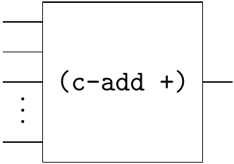
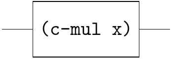
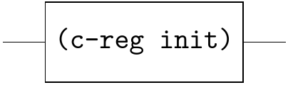
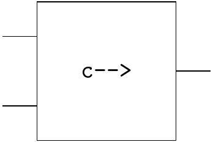
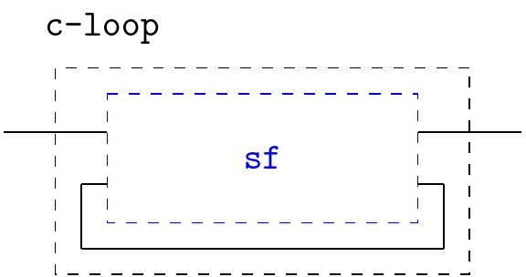
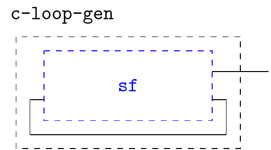
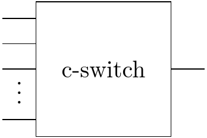
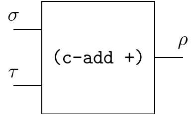
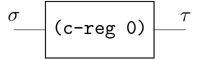

# Qi-circuit

The flows in Racket Qi can be viewed as stream functions if inputs and outputs are streams. We call them stream circuits; in some literature, they
are also referred to as signal flow graphs. Qi-circuit is a domain specific language to allow convenient creating such circuits.

## Core constructs

A large circuit can be constructed by combining small circuits. Qi-circuit currently provides 6 basic circuits:

- `(c-add op)` 

  

  Adder circuit. The `op` is a binary or multiple operator that can be `+` or `*`.

- `(c-mul x)` 

  

  Multiplier circuit scales the input stream by x times.

- `(c-convo s1 s2)` 

  

  Convolution circuit.

- `(c-reg init)` 

  

  Register circuit can be viewed as consisting of a one-place memory cell that initially contains the value `init`.

- `c-->`

  

  Read as "followed by". Let `e` and `f` are streams, the `(c--> e f)` is a stream whose sequence is `(e0 f1 f2 ...)` .

- `(c-loop sf)` 

  

  Feedback loop circuit

- `(c-loop-gen sf)` 

  
  
  Feedback loop circuit (no need input)
  
- `(c-switch args)`

  

  The syntax is the same as [switch](https://docs.racket-lang.org/qi/Language_Interface.html#%28form._%28%28lib._qi%2Fmain..rkt%29._switch%29%29), but based on stream.

  

## Behaviors

Although any Qi flow can be viewed a circuit as long as the inputs and outputs are streams, it's better to think of the inputs and outputs as signals, at time moments 0, 1, 2, ... For example:

The  $\sigma$, $\tau$, $\rho$ are streams, but you should think of them as signals. At moment $n \geq 0$, the adder simultaneously inputs the values $\sigma_n$ and $\tau_n$ at its input ends,and outputs their sum $\rho_n = \sigma_n + \tau_n$ at its output end.

Moreover, even though Qi-circuit is a purely functional programming language (i.e. no side effect), it's better to pretend that the circuits have memory. For example:

The register starts its activity, at time moment 0, by outputting its value 0 at its output end, while it simultaneously inputs the value $\sigma_0$ at its input end, which is stored in the memory cell. At any future time moment $n \geq 1$, the value $\tau_n=\sigma_{n-1}$ is output and the value $\sigma_{n}$ is input and stored.

## Examples

To effectively utilize Qi-circuit, there are two considerations:

1. Most known circuits are not written in Qi-circuit syntax. Typically, for ease of writing, they incorporate shorthands or "sugars" to streamline circuits. As a result, when constructing circuits with Qi-circuit, it is necessary to translate those circuits into Qi-circuit compatible equivalent circuits.
2. Handling circuits with feedback loops, especially in a [strict programming language](https://en.wikipedia.org/wiki/Strict_programming_language) such as Racket, is a challenge. The solution is still translating those circuits into equivalent circuits.

Note that equivalent circuits might look very different from the original circuits! The following will illustrate the two considerations through some concrete examples.

- [Sum](qi-circuit-examples/sum.md)
- [Integral](qi-circuit-examples/integral.md)
- [Factorial](qi-circuit-examples/factorial.md)
- [Fibonacci](qi-circuit-examples/fibonacci.md), [Rabbit Farming](qi-circuit-examples/rabbit-farming.md)
- [Solving ODE 1](qi-circuit-examples/ode-1st.md)
- [Solving ODE 2](qi-circuit-examples/ode-2nd.md)
- [Catalan numbers](qi-circuit-examples/catalan.md)
- [Raising edge](qi-circuit-examples/raising-edge.md), [MinMax](qi-circuit-examples/minmax.md) [Bistable](qi-circuit-examples/bistable.md), [Counter](qi-circuit-examples/counter.md)

## TODO

- Add Clock
- Can work with multiple recursive variables in `c-loop` at the moment?
  - Try another version of Flip-flop in Arrow SF
- Multiple streams vs One stream of values (with zip, unzip)
  - The former is Qi-circuit
  - The latter is Arrow SF (need lazy pattern matching for `values`?)
  - Multiplex in one stream?
- The current circuit is not conducive to modularization because Qi is strict in Racket. 
  - Try `#lang lazy` (need lazy pattern matching for `values`?)
  - Try rewriting diagram in a macro expansion pass.
- Asynchronous Qi-circuit 
- Synchronous Qi-circuit with delta time.
- More examples (e.g. FRP)
