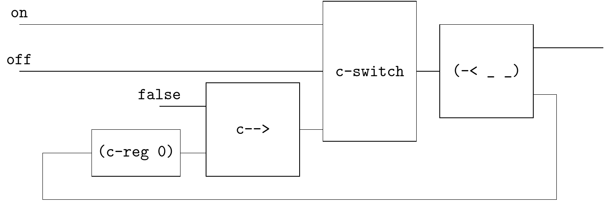

# Bistable

An example from https://homepage.cs.uiowa.edu/~tinelli/classes/181/Spring10/Notes/03-lustre.pdf

```
node Switch(on,off: bool) returns (s: bool);
let s = if(false -> pre s) then not off else on; tel
```




```
(define (bistable-switch on off)
  (~>> (on off)
       ▽
       (c-loop (~>> (== △ (~>> (-< (gen false) (c-reg #f)) c-->))
                    (c-switch (% 3> _)
                              [_ (~>> 2> NOT)]
                              [else 1>])
                    (-< _ _)
                    ))))
```

Reference: https://pfnicholls.com/Electronics/bistable.html