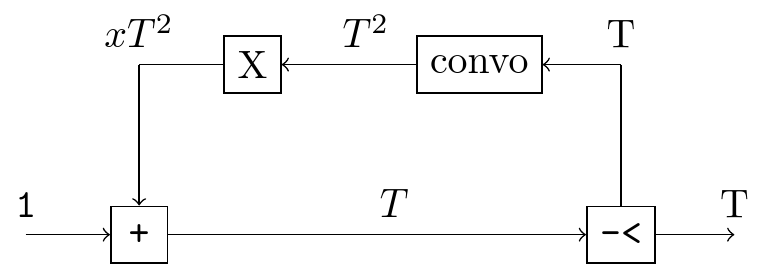
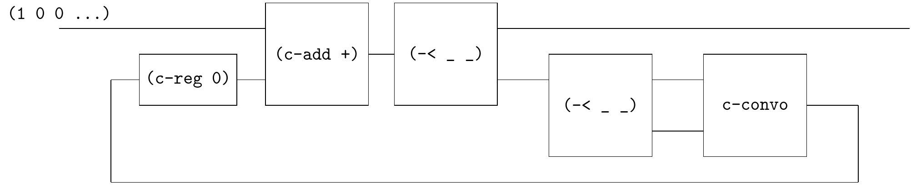

# Catalan numbers

[Power series, power serious](https://www.cambridge.org/core/journals/journal-of-functional-programming/article/power-series-power-serious/19863F4EAACC33E1E01DE2A2114EC7DF) introduces Catalan numbers via solving the generating function equation $T = 1 + x T^2$.

This equation can be translated to the circuit.



step-1



```
(define catalan
  (~>> (one)
       (c-loop (~>> (== _ (c-reg 0))
                    (c-add +)
                    (-< _ (~>> (-< _ _) c-convo))))
       ))
(probe (~>> (catalan) (stream-take _ 10) stream->list))
;; '(1 1 2 5 14 42 132 429 1430 4862)
```


