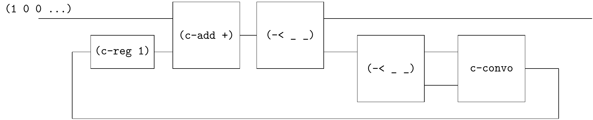

# Catalan numbers

[Power series, power serious](https://www.cambridge.org/core/journals/journal-of-functional-programming/article/power-series-power-serious/19863F4EAACC33E1E01DE2A2114EC7DF) introduces Catalan numbers via solving the generating function equation $T = 1 + x T^2$.

This equation can be transladted to the circuit.



The circuit is similar to the circuit of $\tau = \frac{1}{1 - 2 X} \sigma$ in [Rutten](https://core.ac.uk/download/pdf/82555621.pdf), but it uses convolution.

```
(define-flow sf-catalan
  (~>> (c-loop (~>> (== _ (c-reg 0))
                    (c-add +)
                    (-< _ (~>> (-< _ _) c-convo))))))
(define catalan ((☯ sf-catalan) one))
(probe (~>> (catalan) (stream-take _ 10) stream->list))
;; '(1 1 2 5 14 42 132 429 1430 4862)
```


