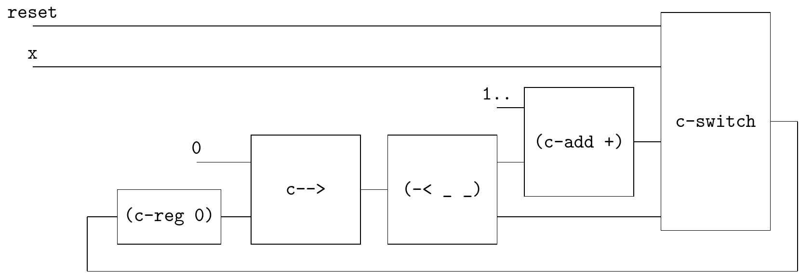

# Counter

```
Counter:
node Count(reset,x: bool) returns (c: int);
let
  c = if reset then 0
    else if x then (0->pre c) + 1
    else (0->pre c);
tel
```




```
(define (counter reset x)
  (~>> (reset x)
       ▽
       (c-loop (~>> (== △ (~>> (c-reg 0) (-< (gen zero) _) c--> (-< (~>> (-< (gen ones) _) (c-add +)) _)))
       ; reset × x × (0->pre c) + 1 × (0->pre c)
                    (c-switch (% _ _)
                              [1> 0]
                              [2> 3>]
                              [else 4>])
                    (-< _ _)
                    ))))
```

