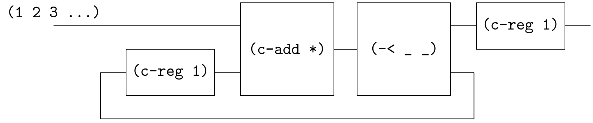

# Factorial



```
;; factorial = product
(define product (stream-cons 1 (map * product positives)))
(~>> (product) (stream-take _ 10) stream->list)

(define fact (~>> (positives)
                  (c-loop (~>> (== _ (c-reg 1)) (c-add *) (-< _ _)))
                  (c-reg 1)
                  ))
(probe (~>> (fact) (stream-take _ 10) stream->list))
;; '(1 2 6 24 120 720 5040 40320 362880 3628800)
```

