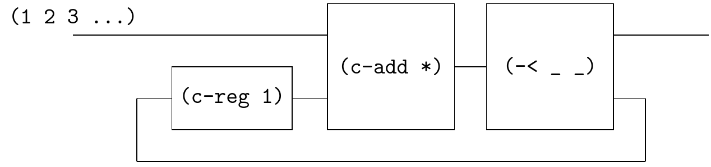

# Factorial



The circuit is similar to sf-4.17, but use multiplication

```
(define fact (~>> (positives)
                  (c-loop (~>> (== _ (c-reg 1)) (c-add *)   (-< _ _)))
                  ))
(probe (~>> (fact) (stream-take _ 10) stream->list))
;; '(1 2 6 24 120 720 5040 40320 362880 3628800)

(define fact0 (~>> (fact) (c-reg 0)))
(probe (~>> (fact0) (stream-take _ 10) stream->list))
;; '(0 1 2 6 24 120 720 5040 40320 362880)
```

