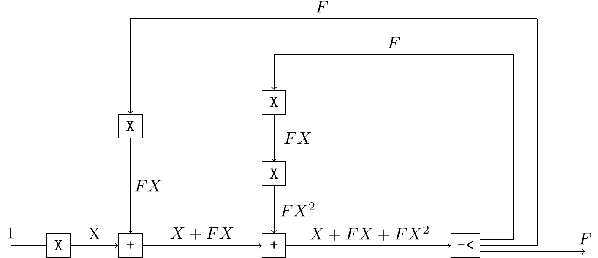
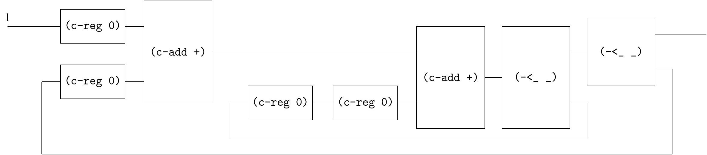
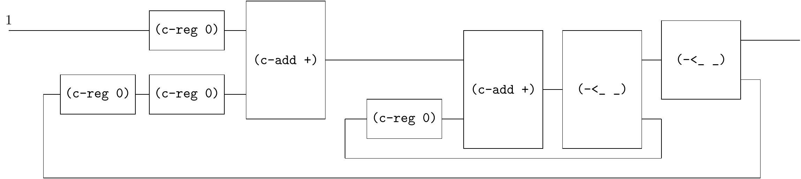
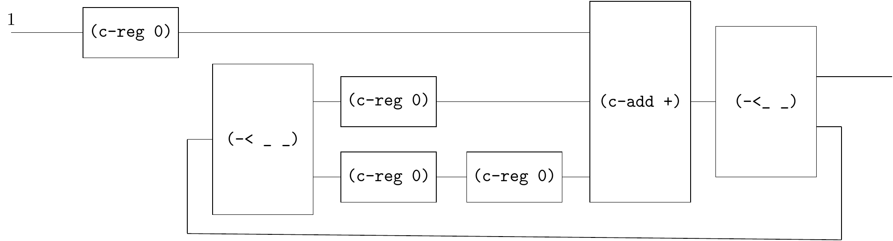
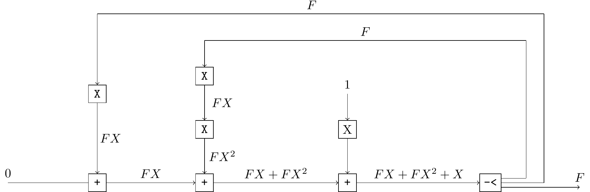
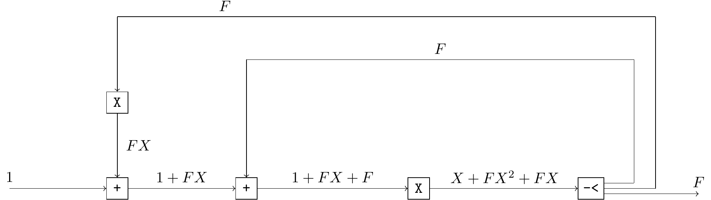
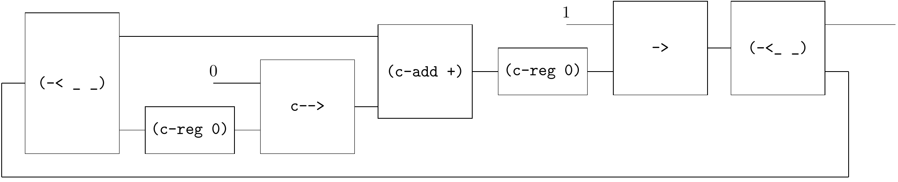

# Fibonacci

The generating function of Fibonacci sequence is $F = \frac{X}{1 - X - X^2}$. 

We can derive the recursive equation $F = X + F X + F X^2$ from the generating function.

One way to solve the recursive equation is to use stream algorithms, i.e.

```
(define F (stream-cons 0 (stream-cons 1 (map + F (stream-rest F)))))
(~>> (F) (stream-take _ 20) stream->list)
;; '(0 1 1 2 3 5 8 13 21 34 55 89 144 233 377 610 987 1597 2584 4181)
```

However, the recursive equation can also be represented as circuits.

Note that there are many equivalent circuits for the same recursive equation. 

For examples:

$F = (X + F X) + F X^2$





$F = (X + F X^2) + F X$




At first glance, it seems that we have to use two `c-loop`s, but in fact, these two loops can be merged into one.

$F = X + F (X + X^2)$


Also, the two additions can be merge to one, because `(c-add +)` can work with multiple inputs.



```
(define fib
  (~>> (one)
       (c-reg 0)
       (c-loop (~>> (== _ (~>> (-< (c-reg 0) (~>> (c-reg 0) (c-reg 0))) ))
                    (c-add +)
                    (-< _ _)))
       ))
       
(~>> (fib) (stream-take _ 20) stream->list)
;; '(0 1 1 2 3 5 8 13 21 34 55 89 144 233 377 610 987 1597 2584 4181)
```

As follows are some other possible implementations:

$F = (F X + F X^2) + X$



$F = (1 + F X + F) X$



All these circuits above are equivent circuits. In other words, the input $1$ can be replaced with other stream $\sigma$, see [rabbit-farming](rabbit-farming.md).


---

Fibonacci can also be implemented by `c-loop-gen`.

```
(define fib
  (~>> ()
       (c-loop-gen (~>> (c-reg 0) (-< _ (c-reg 1)) (c-add +) (-< _ _)))
       (c-reg 0)
       ))

(probe (~>> (fib) (stream-take _ 20) stream->list))
;; '(0 1 1 2 3 5 8 13 21 34 55 89 144 233 377 610 987 1597 2584 4181)
```

This stream corresponds to the following circut.

$F = (F + (FX + 1)) X$


This circuit seems more readable.


---

An example from https://homepage.cs.uiowa.edu/~tinelli/classes/181/Spring10/Notes/03-lustre.pdf

```
f = 1 -> pre( f + (0 -> pre f));
```

It can be represented via circuit.



```
(define f
  (~>> ()
       (c-loop-gen (~>> (-< (gen ones) (c-reg 0))
                        c-->
                        (-< _ (~>> (c-reg 0) (-< (gen zero) _) c-->))
                        (c-add +)
                        (-< _ _)
                        ))
       (-< (gen ones) (c-reg 0))
       c-->))
```


