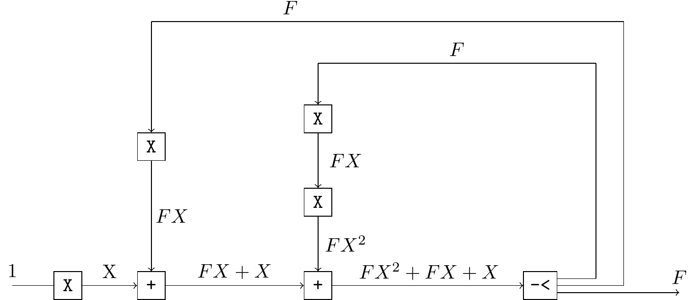
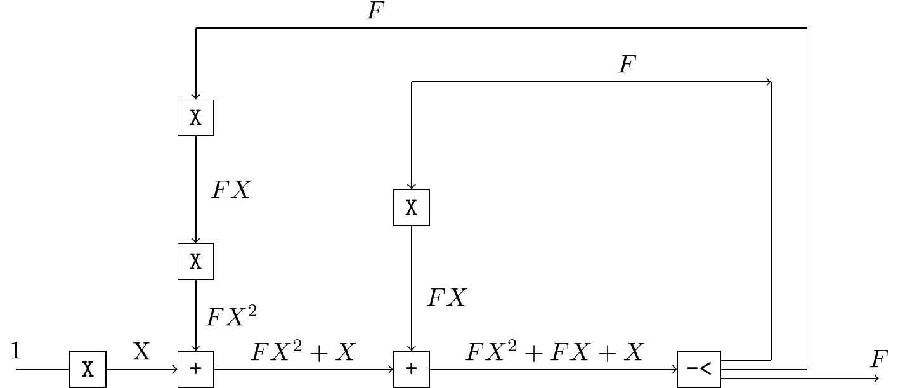
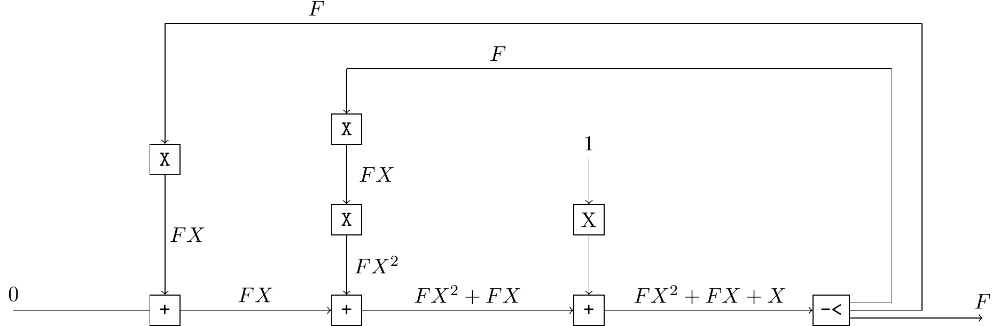
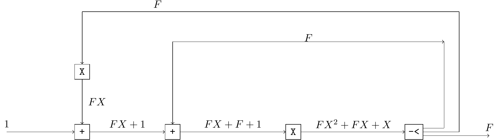
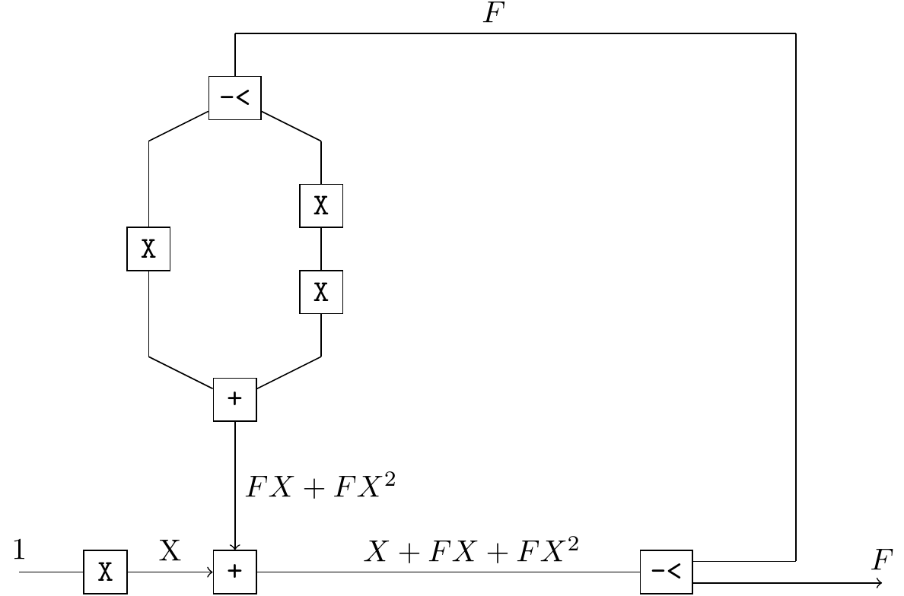
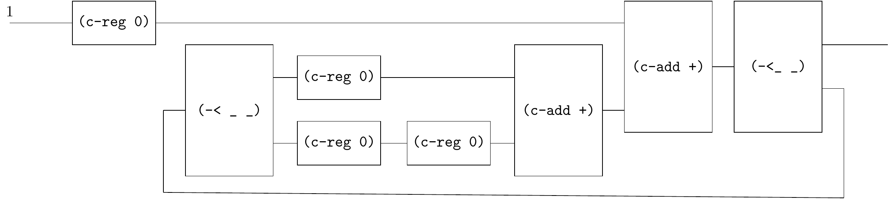
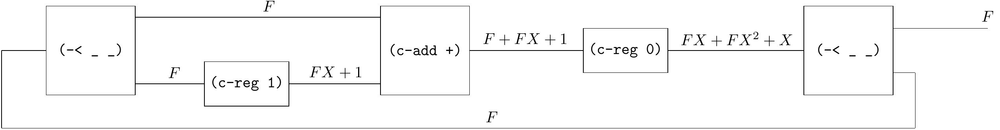
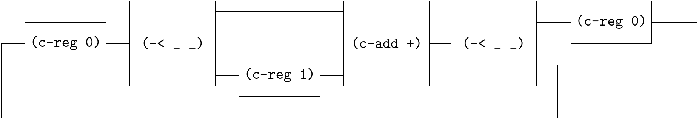

# Fibonacci

The generating function of Fibonacci sequence is $F = \frac{X}{1 - X - X^2}$. 

We can derive the recursive equation $F = X + F X + F X^2$ from the generating function.

One way to solve the recursive equation is to use stream algorithms, i.e.

```
(define F (stream-cons 0 (stream-cons 1 (map + F (stream-rest F)))))
(~>> (F) (stream-take _ 20) stream->list)
;; '(0 1 1 2 3 5 8 13 21 34 55 89 144 233 377 610 987 1597 2584 4181)
```

However, the recursive equation can also be represented as circuits.

For example,




Note that there are many equivalent circuits for the same recursive equation; this is just one of them. i.e. $F = (X + F X) + F X^2$. 

As follows are other possible implementations:

$F = (X + F X^2) + F X$




$F = (F X + F X^2) + X$




$F = (1 + F X + F) X$




$F = X + F (X + X^2)$




All the above circuits can be implemented using qi-circuit. The last circuit requires only one loop, so it should be more efficient. 

Its equivalent Qi-circuit is



```
(define fib
  (~>> (one)
       (c-reg 0)
       (c-loop (~>> (== _ (~>> (-< (c-reg 0) (~>> (c-reg 0) (c-reg 0))) (c-add +)))
                    (c-add +)
                    (-< _ _)))))

(probe (~>> (fib) (stream-take _ 20) stream->list))
;; '(0 1 1 2 3 5 8 13 21 34 55 89 144 233 377 610 987 1597 2584 4181)
```


---

Fibonacci can also be implemented by `c-loop-gen`.

```
(define fib
  (~>> ()
       (c-loop-gen (~>> (c-reg 0) (-< _ (c-reg 1)) (c-add +) (-< _ _)))
       (c-reg 0)
       ))

(probe (~>> (fib) (stream-take _ 20) stream->list))
;; '(0 1 1 2 3 5 8 13 21 34 55 89 144 233 377 610 987 1597 2584 4181)
```

This stream corresponds to the following circut.

$F = (F + (FX + 1)) X$







