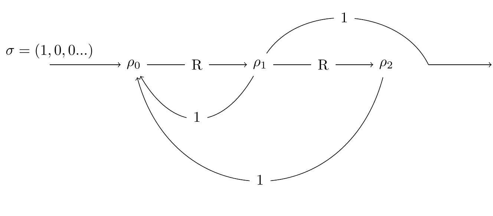
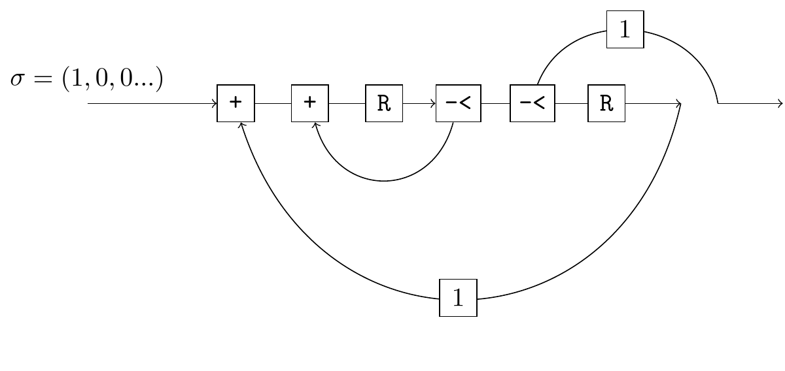
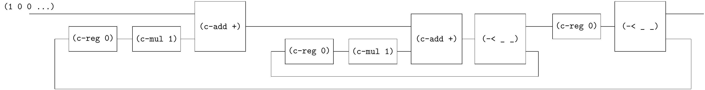

# Fibonacci

From [Rutten Theorem 4.25 and Corollary 4.26](https://core.ac.uk/download/pdf/82555621.pdf)

> A stream $ρ ∈ R^ω$ is rational if and only if it is generated by a (finite) stream circuit.

We know that the generating function of Fibonacci sequence is $\frac{X}{1 - X - X^2}$, which is rational. Thus its stream circuit is automatically:



Similarly, we must translated it into an equivalent circuit.

step-1



step-2



```
(define-flow sf
  (~>> (c-loop (~>> (== _ (~> (c-reg 0) (c-mul 1)))
                    (c-add +)
                    (c-loop (~>> (== _ (~> (c-reg 0) (c-mul 1))) (c-add +) (-< _ _)))
                    (c-reg 0)
                    (-< _ _)))
       (c-mul 1)))
       
(define fib ((☯ sf) one)) 
(probe (~>> (fib) (stream-take _ 20) stream->list))
;; '(0 1 1 2 3 5 8 13 21 34 55 89 144 233 377 610 987 1597 2584 4181)
```
