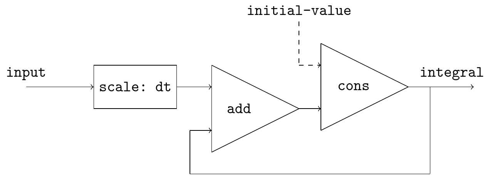
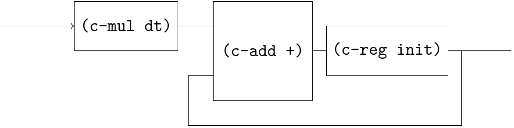
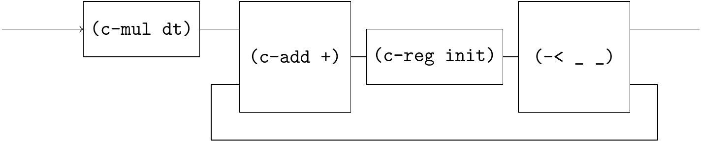
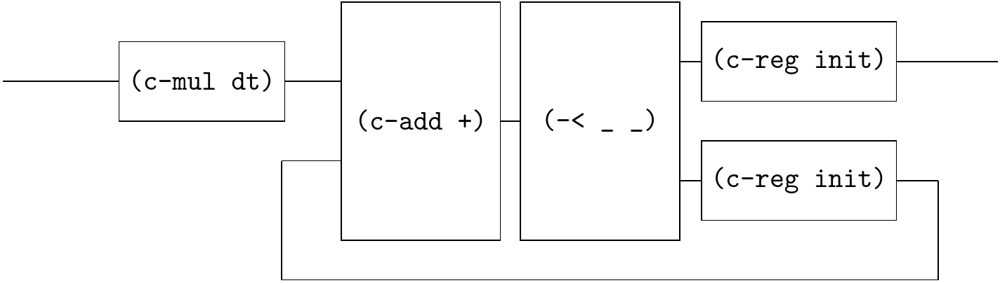
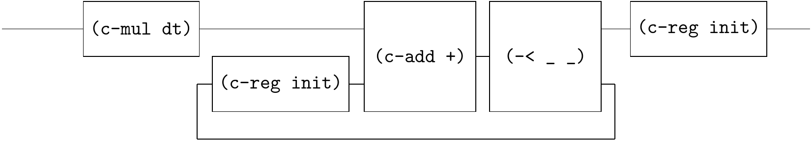

# Integral

[SICP Figure 3.32](https://web.mit.edu/6.001/6.037/sicp.pdf) introduces the integral procedure viewed as a signal processing system:



This diagram cannot be directly written in Qi-circuit, but it can be translated to an equivalent circuit.

step-1



step-2



step-3



step-4



```
(define (integral init dt)
  (☯ (~>> (mul dt) (c-loop (~>> (== _ (reg init)) (add +) (-< _ _))) (reg init))))
```