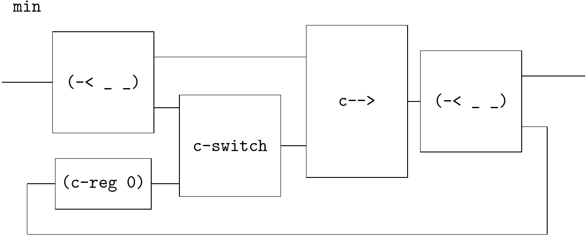

# MinMax

Example from https://homepage.cs.uiowa.edu/~tinelli/classes/181/Spring10/Notes/03-lustre.pdf

```
node MinMax(X : int)
returns (min, max : int); – several outputs
let
  min = X -> if (X < pre min) then X else pre min;
  max = X -> if (X > pre max) then X else pre max;
tel
```



```
(define-flow min
  (~>> (c-loop (~>> (== (-< _ _) (c-reg 0))
                    (-< (~>> (select 1))
                        (~>> (select 2 3)
                             (c-switch (% _ _)
                                       [< 1>]
                                       [else 2>])) )
                    c-->
                    (-< _ _)))
       ))
```

