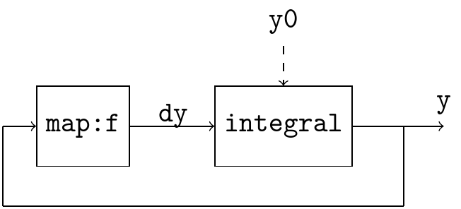
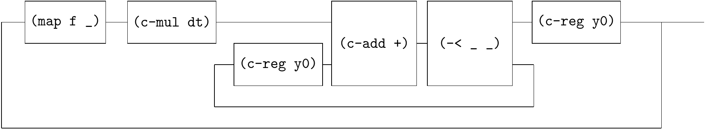
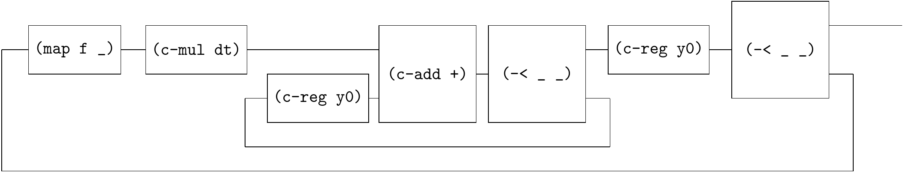
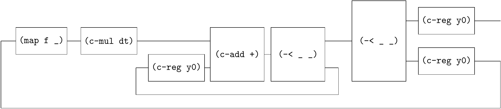
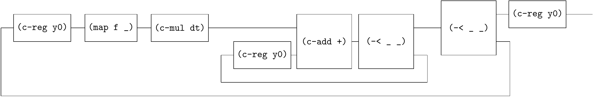
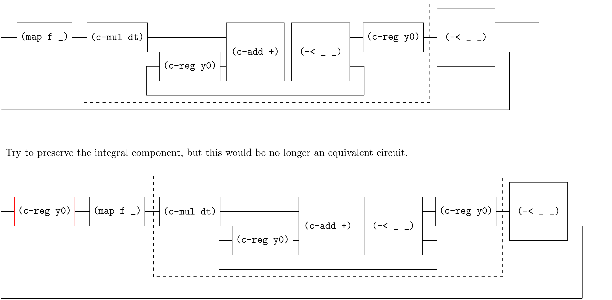

# Solving ODE 1

[SICP 3.5.4 Figure-3.34](https://web.mit.edu/6.001/6.037/sicp.pdf) introduces an "analog computer circuit" that solves the equation $dy/dt = f(y)$.



Translate the diagram to an equivalent circuit.

step-1



step-2



step-3



step-4



The outer loop has only outputs but no inputs, so use `c-loop-gen` instead of `c-loop`.

```
(define (solve f y0 dt)
  (~>> ()
       (c-loop-gen (~>> (c-reg y0)
                        (map f _)
                        (c-mul dt)
                        (c-loop (~>> (== _ (c-reg y0)) (c-add +) (-< _ _)))
                        (-< _ _)))
       (c-reg y0)
       ))
```

Note that this example also shows that you cannot treat `integral` as an independent component, because `(c-reg y0)` must be on the leftmost side of `sf` in the `c-loop` or `c-loop-gen`. Artificially adding a wrong `(c-reg y0)` would result in a non-equivalent circuit.



