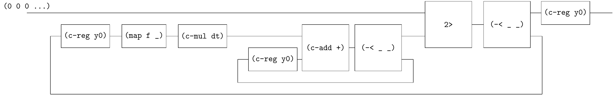
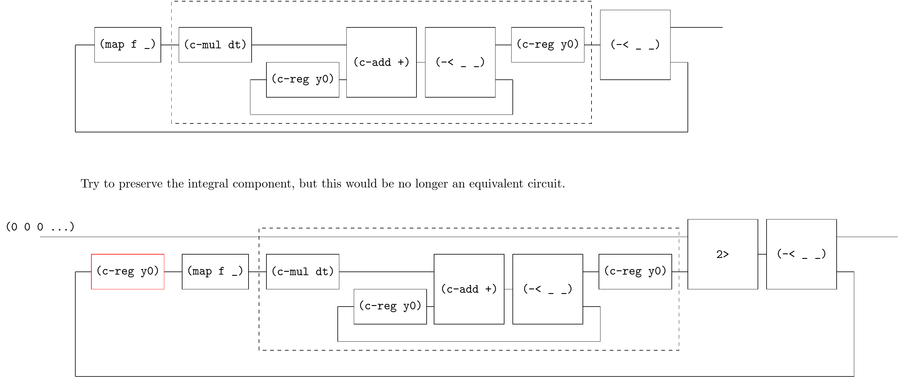

# Solving ODE 1

[SICP 3.5.4 Figure-3.34](https://web.mit.edu/6.001/6.037/sicp.pdf) introduces an "analog computer circuit" that solves the equation $dy/dt = f(y)$.


On the surface, this diagram looks very different from the previous (it has only outputs but no inputs), yet it still has an equivalent circuit that is compatible with Qi-circuit.

step-1


step-2


step-3


step-4


step-5



```
(define (solve f y0 dt)
  (~>> (zero)
       (c-loop (~>> (== _ (~>> (c-reg y0)
                               (map f _)
                               (c-mul dt)
                               (c-loop (~>> (== _ (c-reg y0)) (c-add +) (-< _ _)))
                               ))
                    2>
                    (-< _ _)))
       (c-reg y0)
       ))
```

Note that this example also shows that you cannot treat `integral` as an independent component, because `(c-reg y0)` must be on the leftmost side of `sf` in the `c-loop`. Artificially adding a `(c-reg y0)` would result in a non-equivalent circuit.

 

