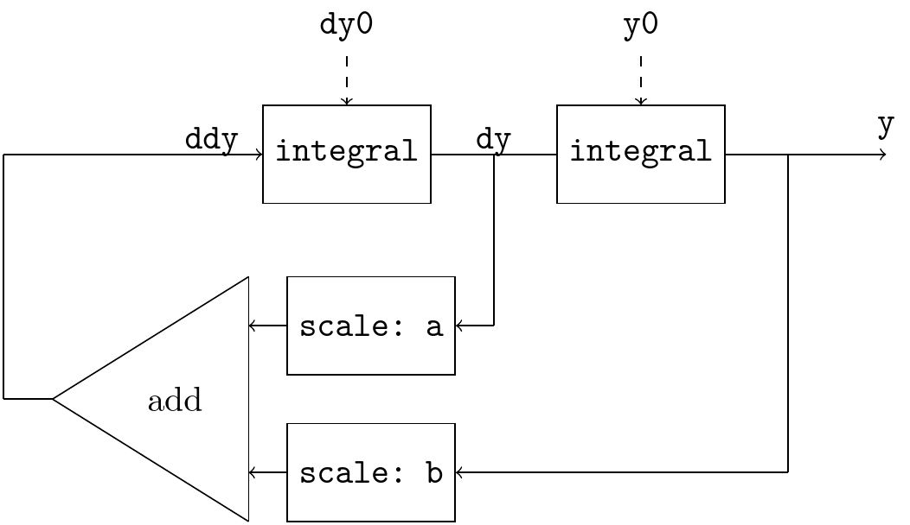
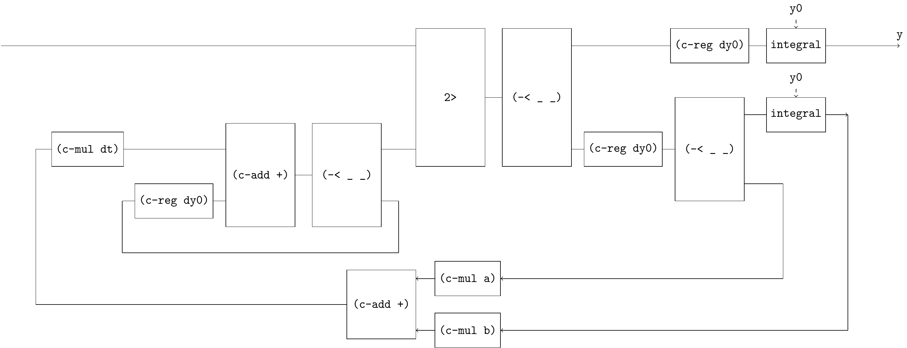
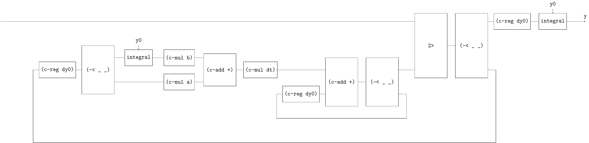
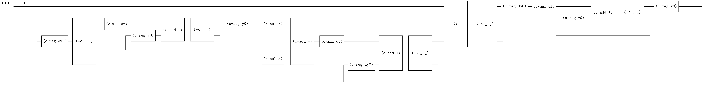

# Solving ODE 2

[SICP 3.5.4 Exercise 3.78](https://web.mit.edu/6.001/6.037/sicp.pdf) introduces an signal-flow diagram for the solution to a second-order linear differential equation $\frac{d^2 y}{dt^2} - a \frac{dy}{dt} - by = 0$



This diagram is more challenging than the previous ones, let’s derive it step by step.

step-1


step-2


step-3


step-4


The 3-ways claw has associative law.

step-5


step-6


step-7



step-8



step-9




```
(define (solve-2nd a b y0 dy0 dt)
  (~>> (zero)
       (c-loop (~>> (== _ (~>> (c-reg dy0)
                               (-< (~>> (c-mul dt)
                                        (c-loop (~>> (== _ (c-reg y0))
                                                     (c-add +)
                                                     (-< _ _)))
                                        (c-reg y0)
                                        (c-mul b))
                                   (c-mul a))
                               (c-add +)
                               (c-mul dt)
                               (c-loop (~>> (== _ (c-reg dy0))
                                            (c-add +)
                                            (-< _ _)))
                               ))
                    2>
                    (-< _ _)
                    ))
       (c-reg dy0)
       (c-mul dt)
       (c-loop (~>> (== _ (c-reg y0))
                    (c-add +)
                    (-< _ _)))
       (c-reg y0)
       ))
```
