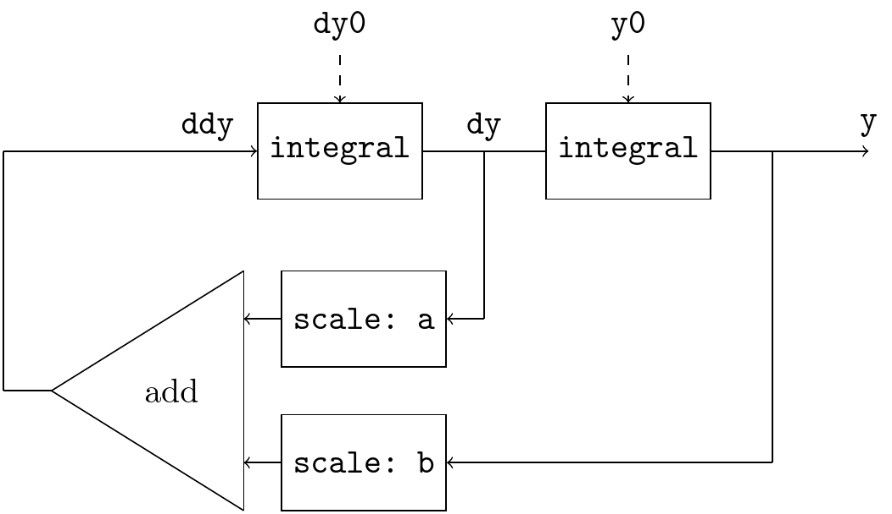
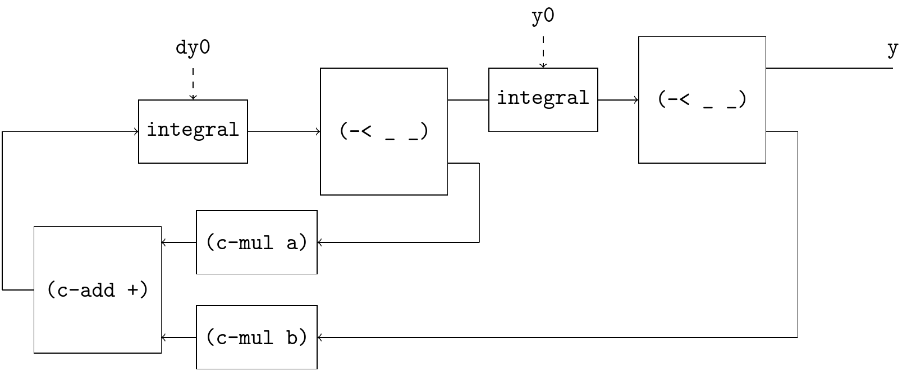
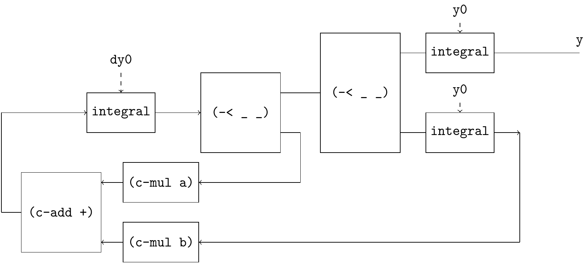
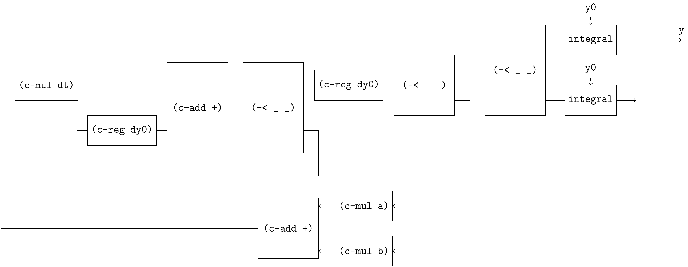
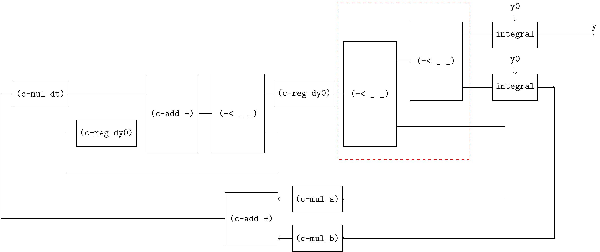
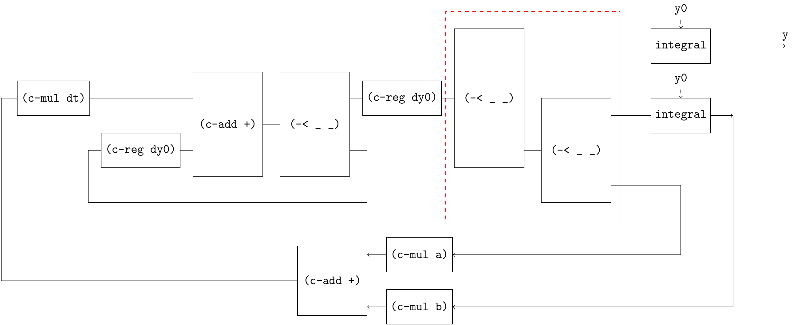
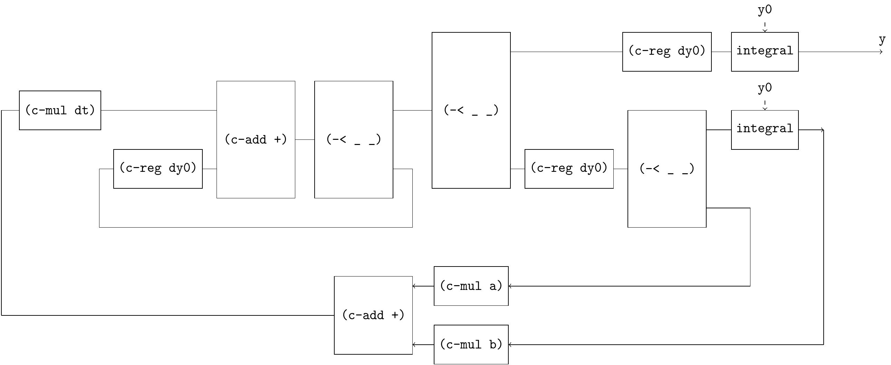
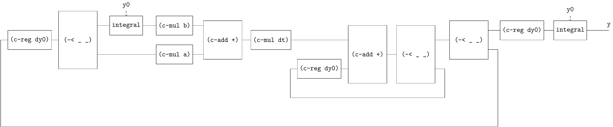
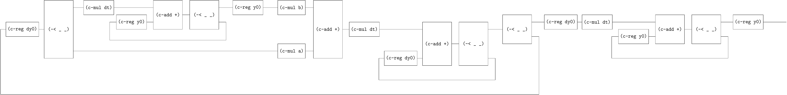

# Solving ODE 2

[SICP 3.5.4 Exercise 3.78](https://web.mit.edu/6.001/6.037/sicp.pdf) introduces an signal-flow diagram for the solution to a second-order linear differential equation $\frac{d^2 y}{dt^2} - a \frac{dy}{dt} - by = 0$



This diagram is more challenging than the previous ones, let’s derive it step by step.

step-1



step-2



step-3



step-4



The 3-ways claw has associative law.

step-5



step-6



step-7



step-8



Since the outer loop has only outputs but no inputs, use `c-loop-gen` instead of `c-loop`.

```
(define (solve-2nd a b y0 dy0 dt)
  (~>> ()
       (c-loop-gen (~>> (c-reg dy0)
                        (-< (~>> (c-mul dt)
                                 (c-loop (~>> (== _ (c-reg y0))
                                              (c-add +)
                                              (-< _ _)))
                                 (c-reg y0)
                                 (c-mul b))
                            (c-mul a))
                        (c-add +)
                        (c-mul dt)
                        (c-loop (~>> (== _ (c-reg dy0))
                                     (c-add +)
                                     (-< _ _)))
                        (-< _ _)
                        ))
       (c-reg dy0)
       (c-mul dt)
       (c-loop (~>> (== _ (c-reg y0))
                    (c-add +)
                    (-< _ _)))
       (c-reg y0)
       ))
```
