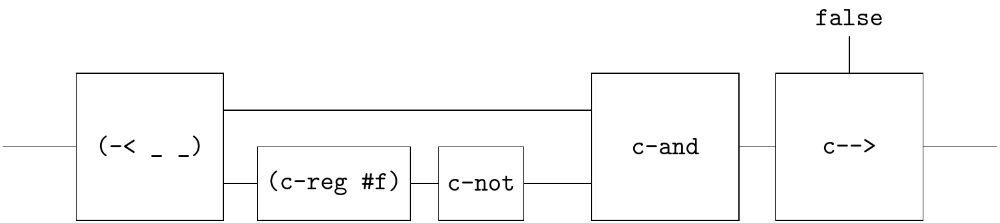

# Raising Edge

An example from https://homepage.cs.uiowa.edu/~tinelli/classes/181/Spring10/Notes/03-lustre.pdf

```
node Edge (X : bool) returns (E : bool);
let
  E = false -> X and not pre X ;
tel
```




```
(define-flow edge
  (~>> (-< _ (~>> (c-reg #f) c-not))
       c-and
       (-< (gen false) _)
       c-->))
```

