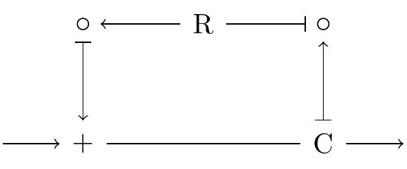
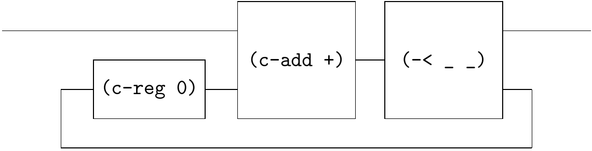
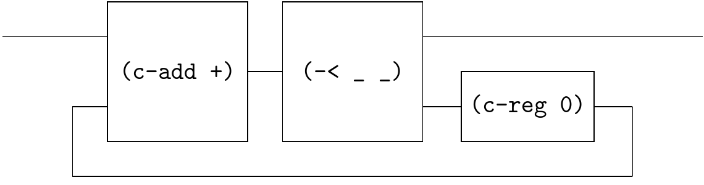
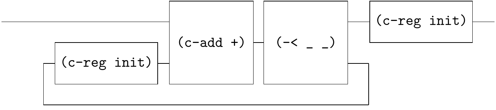

# Sum

[Rutten Example 4.17](https://core.ac.uk/download/pdf/82555621.pdf) shows the circuit:



The corresponding Qi-circuit is 



```
(define-flow sf-4.17
  (~>> (c-loop (~>> (== _ (c-reg 0)) (c-add +) (-< _ _)))))
```

We would have two observations.

- The 1st observation is that `(c-reg 0)` is on the leftmost side of`sf` in the `c-loop`, which is essential!

   If you write it like this

   

   ```
   (define-flow sf-4.17
     (~>> (c-loop (~>> (c-add +) (-< _ _) (== _ (c-reg 0)) ))))
   ```

   Racket will raise an error. The reasons are:

   1. Racket is a [strict programming language](https://en.wikipedia.org/wiki/Strict_programming_language), where `sf` is executed from left to right. When `(c-add +)` is evaluated, its inputs must be a known stream (at least one head).
   2. The `(c-reg 0)` represents a register, at moment 0, it emits a value `0` to `(c-add +)`, not to `(< _ _)`! So it must be on the left side of `(c-add +)`.

   In fact, for any diagram like the second one, you can safely slide the `(c-reg 0)` to the left. They are equivalent circuits.

- The 2nd observation is that the  `sf-4.17` essentially corresponds to the following code:

   ```
   (define (sf-4.17 init s)
     (letrec ((sum0 (stream-cons init sum))
              (sum (map + s sum0)))
       sum))
   ```

   which is different from our favorite code:

   ```
   (define (sf-4.17* init s)
     (letrec ((sum (stream-cons init (map + s sum))))
       sum))
   ```

   If the input stream `s` is `(s0 s1 s2 ...)` and `init` is `0`, then the former outputs `(s0 s0+s1 s0+s1+s2 ...)` while the latter outputs `(0 s0 s0+s1 s0+s1+s2 ...)`. 

   BTW, the latter's diagram is

   

   ```
   (define-flow sf-4.17*
     (~>> (c-loop (~>> (c-add +) (-< _ _) (== _ (c-reg 0)) )) (c-reg 0)))
   ```