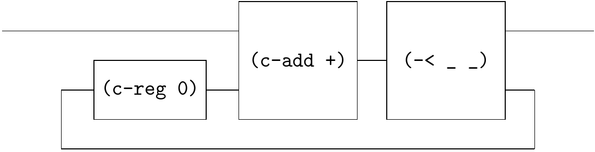
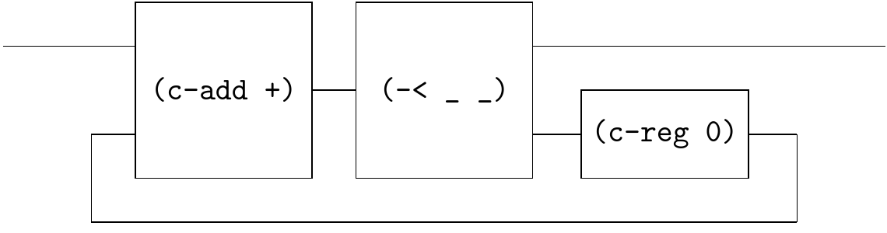
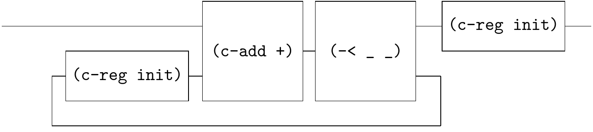
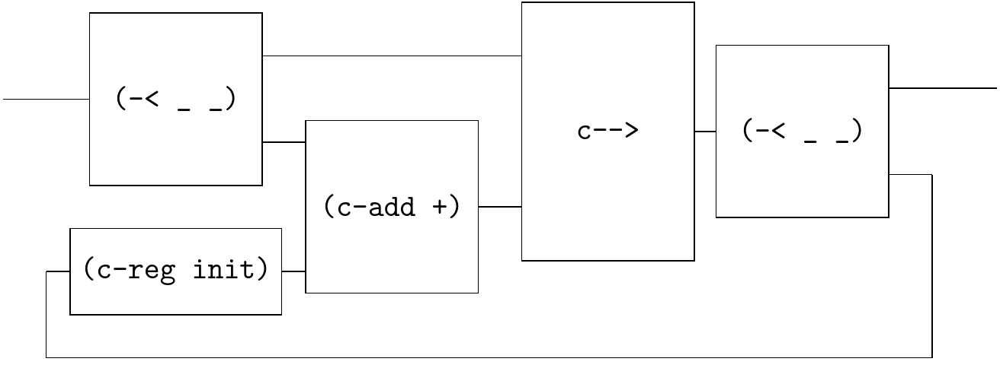

# Sum

[Rutten Example 4.17](https://core.ac.uk/download/pdf/82555621.pdf) shows the circuit:


The corresponding Qi-circuit is 



```
(define-flow sum1
  (~>> (c-loop (~>> (== _ (c-reg 0)) (c-add +) (-< _ _)))))
```

We would have two observations.

- The 1st observation is that `(c-reg 0)` is on the leftmost side of`sf` in the `c-loop`, which is essential!

   If you write it like this

   

   ```
   (define-flow sum1
     (~>> (c-loop (~>> (c-add +) (-< _ _) (== _ (c-reg 0))))))
   ```

   Racket will raise an error. The reasons are:

   1. Racket is a [strict programming language](https://en.wikipedia.org/wiki/Strict_programming_language), where `sf` is executed from left to right. When `(c-add +)` is evaluated, its inputs must be a known stream (at least one head).
   2. The `(c-reg 0)` represents a register, at moment 0, it emits a value `0` to `(c-add +)`, not to `(< _ _)`! So it must be on the left side of `(c-add +)`.

   In fact, for any diagram like the second one, you can safely slide the `(c-reg 0)` to the left. They are equivalent circuits.

- The 2nd observation is that the  `sum1` essentially corresponds to the following stream algorithm if `init` is `0`:

   ```
   (define (sum1 init s)
     (letrec ((sum1 (stream-map* + s (stream-cons init sum1))))
       sum1))
   ```
   
   or equivalent iterative algorithm:
   
   ```
   (define (sum1 reg s)
     (match s
       [(sequence) empty-stream]
       [(sequence x xs ...) (stream-cons (+ x reg) (sum1-iter (+ x reg) xs))]))
   ```

   They are different from:

   ```
   (define (sum2 init s)
     (letrec ((sum (stream-cons init (stream-map* + s sum))))
       sum))
   ```
   
   If the input stream `s` is `(s0 s1 s2 ...)` and `init` is `0`, then the former outputs `(0+s0 0+s0+s1 0+s0+s1+s2 ...)` while the latter outputs `(0 0+s0 0+s0+s1 0+s0+s1+s2 ...)`.
   
   The circuit of `sum2` is:
   
   
   
   ```
   (define (sum2 init)
     (☯ (~>> (c-loop (~>> (== _ (c-reg 0)) (c-add +) (-< _ _))) (c-reg 0))))
   ```
   
   The `sum2` corresponds to `scanl` in Haskell.
   
   Note that, in Haskell, there is also `scanl1`, which corresponds to the following circuit:
   
   
   
   ```
   (define (sum3)
     (☯ (~>> (c-loop (~>> (== (-< _ _) (c-reg 0))
                          (group 1 _ (c-add +))
                          c-->
                          (-< _ _)))
             )))
   ```
   
   See [sum.rkt](sum.rkt) for details.
   
   
   
   


